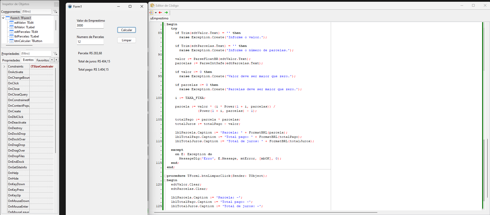

# 📌 Lazarus – Simulador de Empréstimo

Este repositório é um projeto de estudo desenvolvido em Lazarus (Free Pascal – LCL Forms) com o objetivo de praticar conceitos da linguagem Object Pascal e a criação de aplicações desktop.
A proposta foi desenvolver um simulador simples de empréstimo, onde o usuário informa o valor desejado e o número de parcelas, e o sistema calcula automaticamente o valor da parcela, o total pago e o total de juros, utilizando taxa fixa interna.
O projeto foi criado com foco em prática de lógica matemática, fórmulas financeiras (Tabela Price) e manipulação de eventos em formulários.

# ✨ Objetivo

Praticar criação de formulários no Lazarus
Trabalhar com componentes LCL (TEdit, TButton, TLabel)
Aplicar validação de dados digitados pelo usuário
Implementar cálculos financeiros com juros compostos
Reforçar conceitos de funções auxiliares e tratamento de exceções
Manter um histórico de evolução e estudos no GitHub

# 💰 Funcionalidades

Cálculo automático de parcelas com juros fixo
Exibição do total pago ao final do financiamento
Cálculo do total de juros pagos
Validação para evitar valores inválidos
Aceita números com vírgula ou ponto

.
